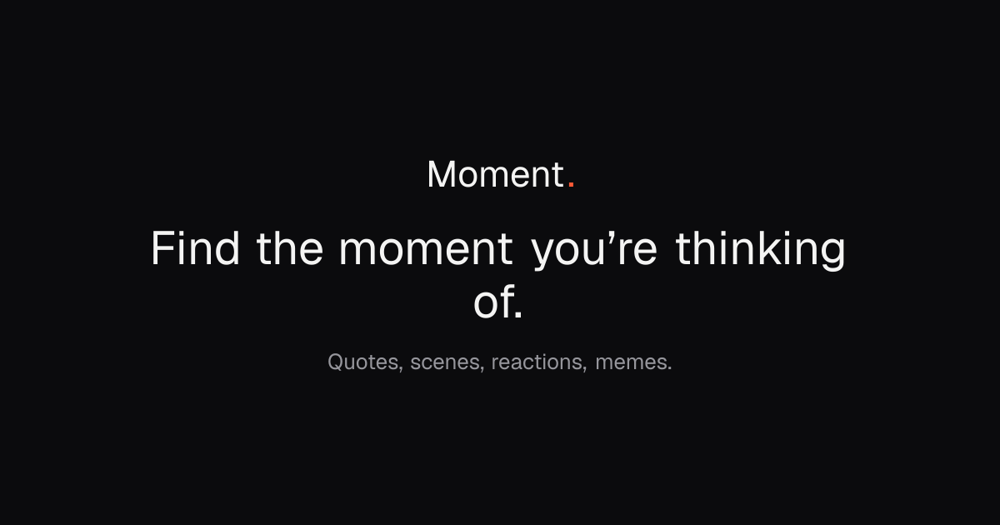

### Leif Hellgren

**Apps**

<table>
<tr>
<td width="150"></td>
<td><strong>Penguin</strong>: an iOS app I'm building. Workout and macro tracking with an LLM coach built in.</td>
</tr>
<tr>
<td width="150"></td>
<td><strong>Moment</strong>: a search engine for finding a GIF or movie clip by describing it instead of guessing the tags.</td>
</tr>
<tr>
<td width="150">

</td>
<td><strong><a href="https://github.com/leif-hellgren1/Subscriptio">Subscriptio</a></strong>: tracks your subscriptions and negotiates retention discounts automatically, without ever cancelling.</td>
</tr>
</table>

Penguin and Moment are private for now, still being built.
